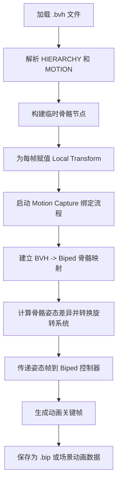

```mermaid
flowchart TD
    A[加载 .bvh 文件] --> B[解析 HIERARCHY 和 MOTION]
    B --> C[构建临时骨骼节点]
    C --> D[为每帧赋值 Local Transform]
    D --> E[启动 Motion Capture 绑定流程]
    E --> F[建立 BVH -> Biped 骨骼映射]
    F --> G[计算骨骼姿态差异并转换旋转系统]
    G --> H[传递姿态帧到 Biped 控制器]
    H --> I[生成动画关键帧]
    I --> J[保存为 .bip 或场景动画数据]
```