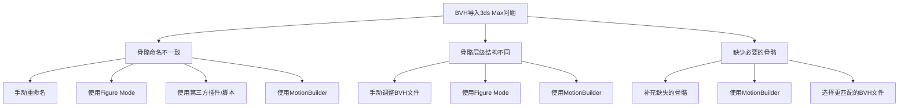

```mermaid
graph TD
    A[BVH导入3ds Max问题] --> B[骨骼命名不一致]
    A --> C[骨骼层级结构不同]
    A --> D[缺少必要的骨骼]
    
    B --> E[手动重命名]
    B --> F[使用Figure Mode]
    B --> G[使用第三方插件/脚本]
    B --> H[使用MotionBuilder]
    
    C --> I[手动调整BVH文件]
    C --> J[使用Figure Mode]
    C --> K[使用MotionBuilder]
    
    D --> L[补充缺失的骨骼]
    D --> M[使用MotionBuilder]
    D --> N[选择更匹配的BVH文件]
```