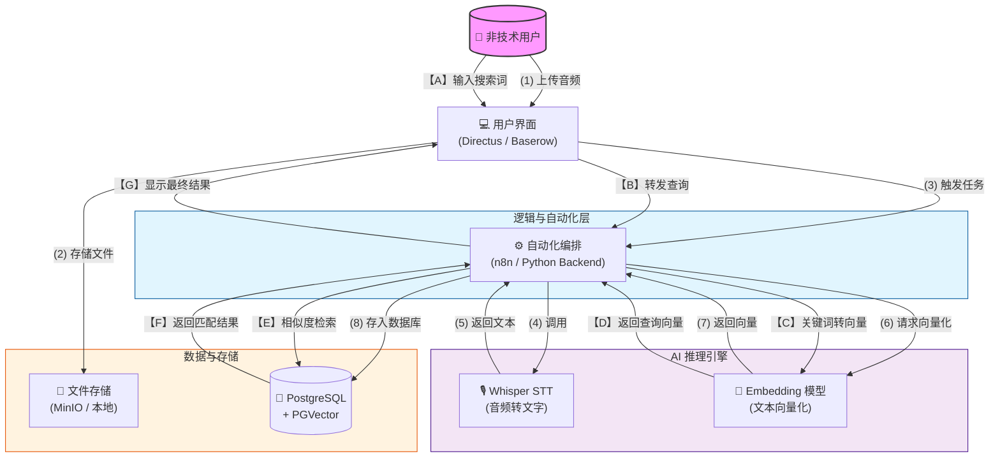

```mermaid
flowchart TD
    %% 节点定义
    User[("👤 非技术用户")]
    UI["💻 用户界面<br/>(Directus / Baserow)"]
    
    subgraph Logic_Layer [逻辑与自动化层]
        Flow["⚙️ 自动化编排<br/>(n8n / Python Backend)"]
    end

    subgraph Storage_Layer [数据与存储]
        FS["📁 文件存储<br/>(MinIO / 本地)"]
        DB[("🐘 PostgreSQL<br/>+ PGVector")]
    end

    subgraph AI_Engines [AI 推理引擎]
        STT["🎙️ Whisper STT<br/>(音频转文字)"]
        EMB["🧠 Embedding 模型<br/>(文本向量化)"]
    end

    %% 流程连接 - 上传与索引
    User -->|"(1) 上传音频"| UI
    UI -->|"(2) 存储文件"| FS
    UI -->|"(3) 触发任务"| Flow
    
    Flow -->|"(4) 调用"| STT
    STT -->|"(5) 返回文本"| Flow
    Flow -->|"(6) 请求向量化"| EMB
    EMB -->|"(7) 返回向量"| Flow
    Flow -->|"(8) 存入数据库"| DB

    %% 流程连接 - 语义搜索
    User -->|"【A】输入搜索词"| UI
    UI -->|"【B】转发查询"| Flow
    Flow -->|"【C】关键词转向量"| EMB
    EMB -->|"【D】返回查询向量"| Flow
    Flow -->|"【E】相似度检索"| DB
    DB -->|"【F】返回匹配结果"| Flow
    Flow -->|"【G】显示最终结果"| UI

    %% 样式美化
    style User fill:#f9f,stroke:#333,stroke-width:2px
    style Logic_Layer fill:#e1f5fe,stroke:#01579b
    style Storage_Layer fill:#fff3e0,stroke:#e65100
    style AI_Engines fill:#f3e5f5,stroke:#4a148c
```