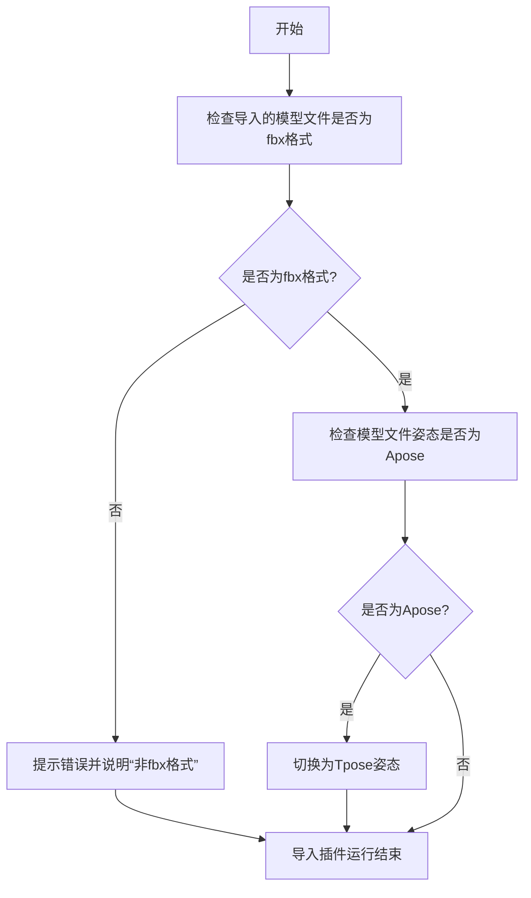

```mermaid
flowchart TD
    Start[开始]
    CheckFBX[检查导入的模型文件是否为fbx格式]
    IsFBX{是否为fbx格式?}
    NotFBX[提示错误并说明“非fbx格式”]
    CheckPose[检查模型文件姿态是否为Apose]
    IsApose{是否为Apose?}
    SwitchPose[切换为Tpose姿态]
    End[导入插件运行结束]

    Start --> CheckFBX --> IsFBX
    IsFBX -- 是 --> CheckPose
    IsFBX -- 否 --> NotFBX --> End
    CheckPose --> IsApose
    IsApose -- 是 --> SwitchPose --> End
    IsApose -- 否 --> End

```