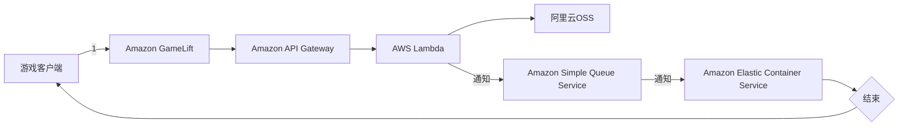

```mermaid
graph LR
    A[游戏客户端] -->|1| B[Amazon GameLift]
    B --> C[Amazon API Gateway]
    C --> D[AWS Lambda]
    D --> E[阿里云OSS]
    D -->|通知| F[Amazon Simple Queue Service]
    F -->|通知| G[Amazon Elastic Container Service]
    G --> H{结束}
    H --> A


```