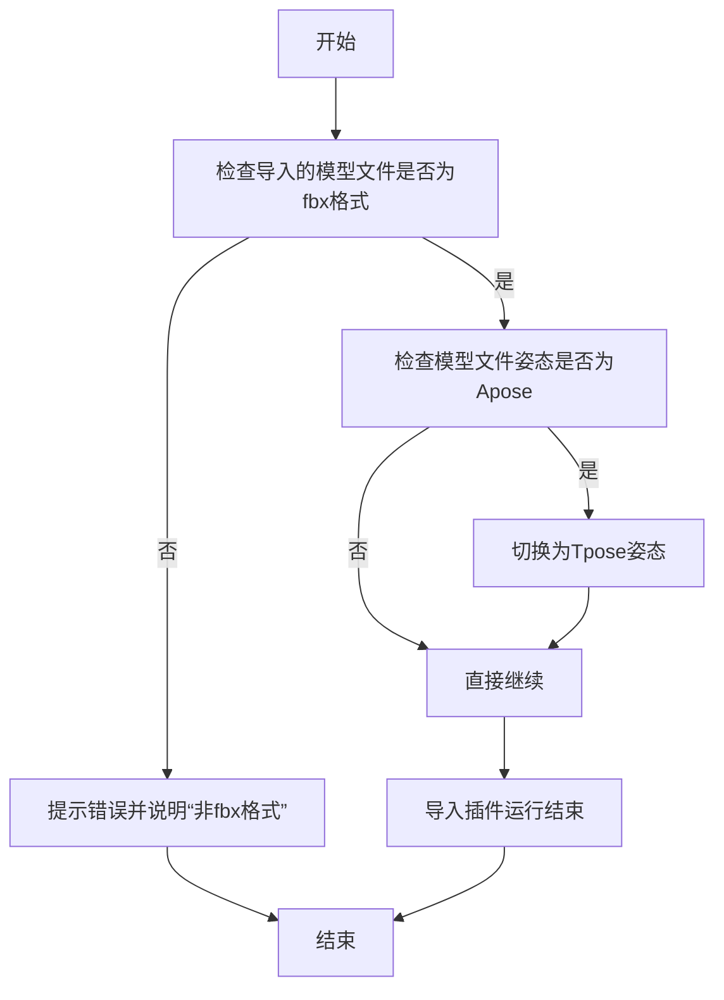

```mermaid
graph TD
    A[开始] --> B[检查导入的模型文件是否为fbx格式]
    B -->|是| C[检查模型文件姿态是否为Apose]
    B -->|否| D[提示错误并说明“非fbx格式”]
    D --> E[结束]
    C -->|是| F[切换为Tpose姿态]
    C -->|否| G[直接继续]
    F --> G
    G --> H[导入插件运行结束]
    H --> E


```