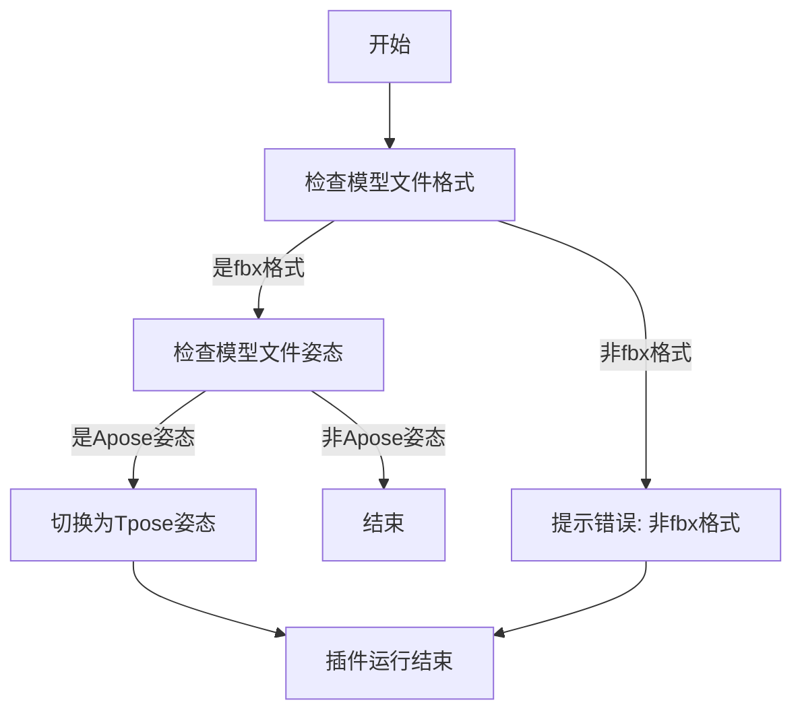

```mermaid
graph TD
    A[开始] --> B[检查模型文件格式]
    B -->|是fbx格式| C[检查模型文件姿态]
    B -->|非fbx格式| D[提示错误: 非fbx格式]
    C -->|是Apose姿态| E[切换为Tpose姿态]
    C -->|非Apose姿态| F[结束]
    E --> G[插件运行结束]
    D --> G


```