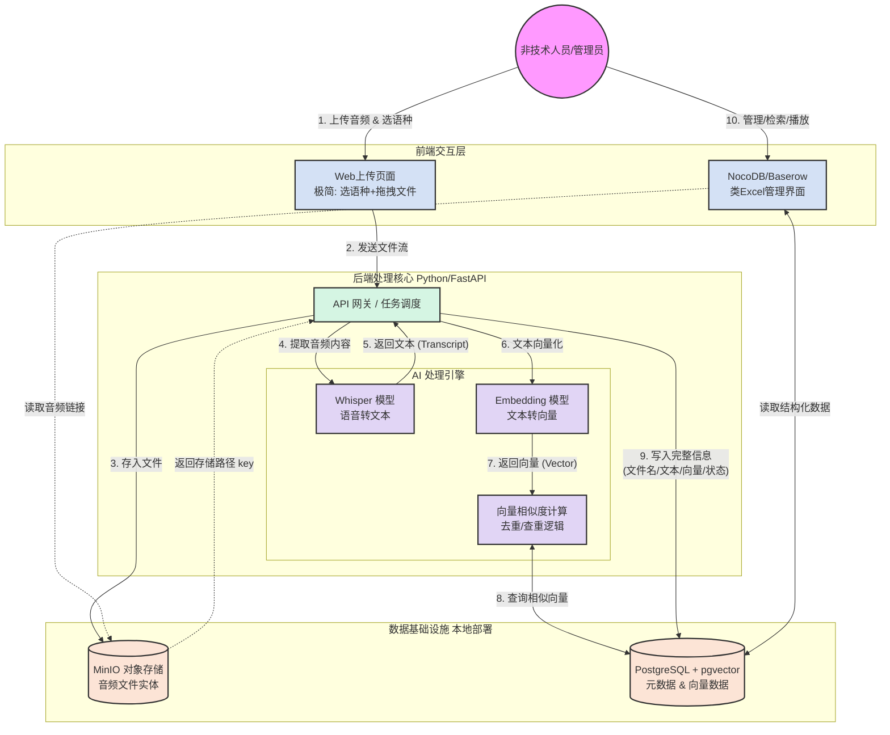

```mermaid
flowchart TD
    %% 定义样式
    classDef user fill:#f9f,stroke:#333,stroke-width:2px;
    classDef frontend fill:#d4e1f5,stroke:#333,stroke-width:2px;
    classDef backend fill:#d5f5e3,stroke:#333,stroke-width:2px;
    classDef storage fill:#fce4d6,stroke:#333,stroke-width:2px;
    classDef ai fill:#e1d5f5,stroke:#333,stroke-width:2px;

    %% 用户层
    User((非技术人员/管理员)):::user

    %% 前端交互层
    subgraph Frontend_Layer [前端交互层]
        direction TB
        UploadUI[Web上传页面\n极简: 选语种+拖拽文件]:::frontend
        NocoDB[NocoDB/Baserow\n类Excel管理界面]:::frontend
    end

    %% 后端核心逻辑层
    subgraph Backend_Layer [后端处理核心 Python/FastAPI]
        API[API 网关 / 任务调度]:::backend
        
        subgraph AI_Engine [AI 处理引擎]
            ASR[Whisper 模型\n语音转文本]:::ai
            Embed[Embedding 模型\n文本转向量]:::ai
            VectorSearch[向量相似度计算\n去重/查重逻辑]:::ai
        end
    end

    %% 数据存储层
    subgraph Storage_Layer [数据基础设施 本地部署]
        MinIO[(MinIO 对象存储\n音频文件实体)]:::storage
        Postgres[(PostgreSQL + pgvector\n元数据 & 向量数据)]:::storage
    end

    %% 关系连线 - 上传流程
    User -- "1. 上传音频 & 选语种" --> UploadUI
    UploadUI -- "2. 发送文件流" --> API
    
    API -- "3. 存入文件" --> MinIO
    MinIO -.->|返回存储路径 key| API

    %% 关系连线 - AI处理流程
    API -- "4. 提取音频内容" --> ASR
    ASR -- "5. 返回文本 (Transcript)" --> API
    API -- "6. 文本向量化" --> Embed
    Embed -- "7. 返回向量 (Vector)" --> VectorSearch

    %% 关系连线 - 数据库交互与去重
    VectorSearch <-->|"8. 查询相似向量"| Postgres
    API -- "9. 写入完整信息\n(文件名/文本/向量/状态)" --> Postgres

    %% 关系连线 - 管理流程
    User -- "10. 管理/检索/播放" --> NocoDB
    NocoDB <-->|"读取结构化数据"| Postgres
    NocoDB -.->|"读取音频链接"| MinIO
```