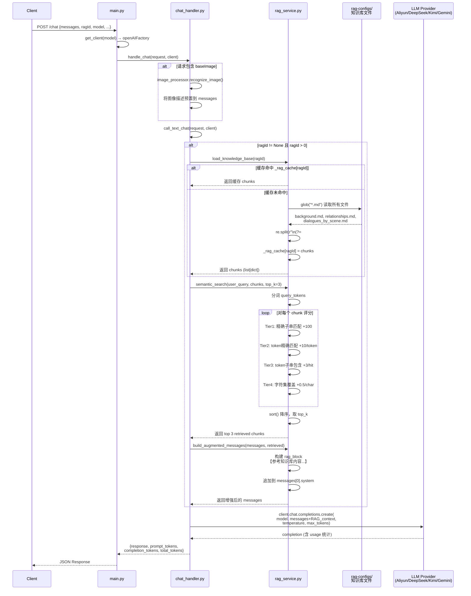

```mermaid
  sequenceDiagram
      participant C as Client
      participant M as main.py
      participant CH as chat_handler.py
      participant RS as rag_service.py
      participant KB as rag-configs/<br/>知识库文件
      participant LLM as LLM Provider<br/>(Aliyun/DeepSeek/Kimi/Gemini)

      C->>M: POST /chat {messages, ragId, model, ...}
      M->>M: get_client(model) → openAIFactory
      M->>CH: handle_chat(request, client)

      alt 请求包含 baseImage
          CH->>CH: image_processor.recognize_image()
          CH->>CH: 将图像描述预置到 messages
      end

      CH->>CH: call_text_chat(request, client)

      alt ragId != None 且 ragId > 0
          CH->>RS: load_knowledge_base(ragId)

          alt 缓存命中 _rag_cache[ragId]
              RS-->>CH: 返回缓存 chunks
          else 缓存未命中
              RS->>KB: glob("*.md") 读取所有文件
              KB-->>RS: background.md, relationships.md,<br/>dialogues_by_scene.md
              RS->>RS: re.split(r"\n(?=## )", text)<br/>按二级标题分割成 chunks
              RS->>RS: _rag_cache[ragId] = chunks
              RS-->>CH: 返回 chunks (list[dict])
          end

          CH->>RS: semantic_search(user_query, chunks, top_k=3)
          RS->>RS: 分词 query_tokens
          loop 对每个 chunk 评分
              RS->>RS: Tier1: 精确子串匹配 +100
              RS->>RS: Tier2: token精确匹配 +10/token
              RS->>RS: Tier3: token子串包含 +3/hit
              RS->>RS: Tier4: 字符集覆盖 +0.5/char
          end
          RS->>RS: sort() 降序，取 top_k
          RS-->>CH: 返回 top 3 retrieved chunks

          CH->>RS: build_augmented_messages(messages, retrieved)
          RS->>RS: 构建 rag_block<br/>【参考知识库内容...】
          RS->>RS: 追加到 messages[0].system
          RS-->>CH: 返回增强后的 messages
      end

      CH->>LLM: client.chat.completions.create(<br/>model, messages+RAG_context,<br/>temperature, max_tokens)
      LLM-->>CH: completion (含 usage 统计)
      CH-->>M: {response, prompt_tokens,<br/>completion_tokens, total_tokens}
      M-->>C: JSON Response

```