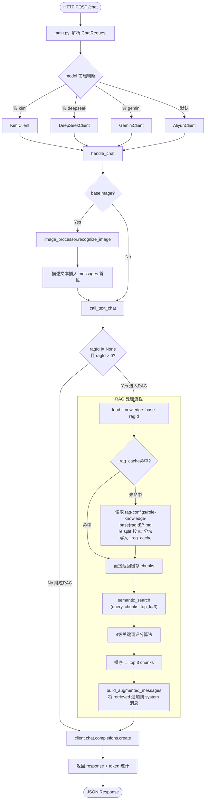

```mermaid
flowchart TD
    A([HTTP POST /chat]) --> B[main.py: 解析 ChatRequest]
    B --> C{model 前缀判断}
    C -->|含 kimi| D[KimiClient]
    C -->|含 deepseek| E[DeepSeekClient]
    C -->|含 gemini| F[GeminiClient]
    C -->|默认| G[AliyunClient]
    D & E & F & G --> H[handle_chat]

    H --> I{baseImage?}
    I -->|Yes| J[image_processor.recognize_image]
    J --> K[描述文本插入 messages 首位]
    K --> L[call_text_chat]
    I -->|No| L

    L --> M{ragId != None<br/>且 ragId > 0?}
    M -->|No 跳过RAG| S
    M -->|Yes 进入RAG| N

    subgraph RAG["RAG 处理流程"]
        N[load_knowledge_base ragId] --> O{_rag_cache命中?}
        O -->|命中| Q[直接返回缓存 chunks]
        O -->|未命中| P["读取 rag-configs/role-knowledge-base{ragId}/*.md<br/>re.split 按 ## 分块<br/>写入 _rag_cache"]
        P --> Q

        Q --> R["semantic_search<br/>(query, chunks, top_k=3)"]
        R --> R1[4级关键词评分算法]
        R1 --> R2[排序 → top 3 chunks]

        R2 --> T["build_augmented_messages<br/>将 retrieved 追加到 system 消息"]
    end

    T --> S[client.chat.completions.create]
    S --> U[返回 response + token 统计]
    U --> V([JSON Response])

```