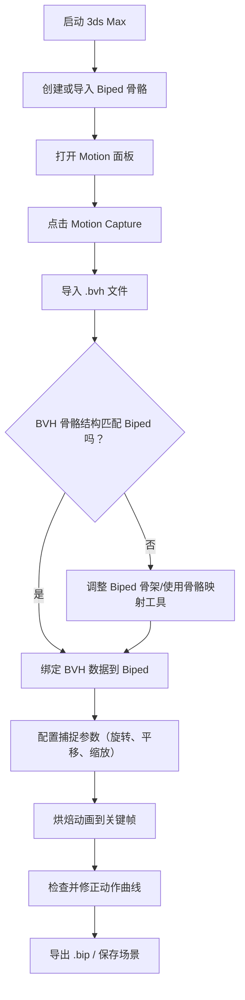

```mermaid
flowchart TD
    A[启动 3ds Max] --> B[创建或导入 Biped 骨骼]
    B --> C[打开 Motion 面板]
    C --> D[点击 Motion Capture]
    D --> E[导入 .bvh 文件]
    E --> F{BVH 骨骼结构匹配 Biped 吗？}
    F -- 否 --> G[调整 Biped 骨架/使用骨骼映射工具]
    F -- 是 --> H[绑定 BVH 数据到 Biped]
    G --> H
    H --> I[配置捕捉参数（旋转、平移、缩放）]
    I --> J[烘焙动画到关键帧]
    J --> K[检查并修正动作曲线]
    K --> L[导出 .bip / 保存场景]

```