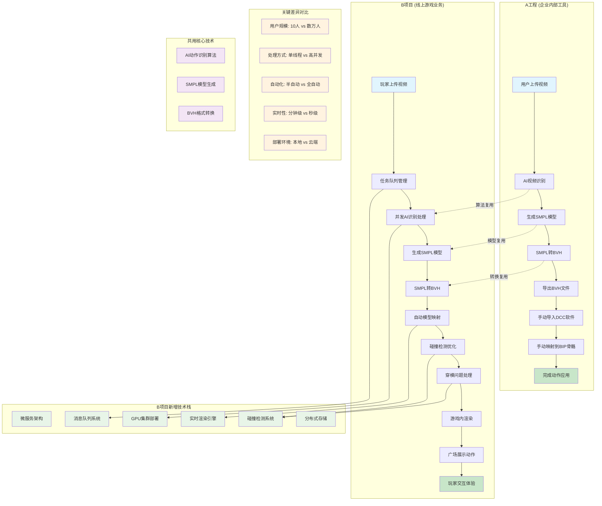

```mermaid
graph TD
    subgraph "A工程 (企业内部工具)"
        A1[用户上传视频] --> A2[AI视频识别]
        A2 --> A3[生成SMPL模型]
        A3 --> A4[SMPL转BVH]
        A4 --> A5[导出BVH文件]
        A5 --> A6[手动导入DCC软件]
        A6 --> A7[手动映射到BIP骨骼]
        A7 --> A8[完成动作应用]
        
        style A1 fill:#e1f5fe
        style A8 fill:#c8e6c9
    end
    
    subgraph "B项目 (线上游戏业务)"
        B1[玩家上传视频] --> B2[任务队列管理]
        B2 --> B3[并发AI识别处理]
        B3 --> B4[生成SMPL模型]
        B4 --> B5[SMPL转BVH]
        B5 --> B6[自动模型映射]
        B6 --> B7[碰撞检测优化]
        B7 --> B8[穿模问题处理]
        B8 --> B9[游戏内渲染]
        B9 --> B10[广场展示动作]
        B10 --> B11[玩家交互体验]
        
        style B1 fill:#e1f5fe
        style B11 fill:#c8e6c9
    end
    
    subgraph "关键差异对比"
        C1[用户规模: 10人 vs 数万人]
        C2[处理方式: 单线程 vs 高并发]
        C3[自动化: 半自动 vs 全自动]
        C4[实时性: 分钟级 vs 秒级]
        C5[部署环境: 本地 vs 云端]
        
        style C1 fill:#fff3e0
        style C2 fill:#fff3e0
        style C3 fill:#fff3e0
        style C4 fill:#fff3e0
        style C5 fill:#fff3e0
    end
    
    subgraph "共用核心技术"
        D1[AI动作识别算法]
        D2[SMPL模型生成]
        D3[BVH格式转换]
        
        style D1 fill:#f3e5f5
        style D2 fill:#f3e5f5
        style D3 fill:#f3e5f5
    end
    
    subgraph "B项目新增技术栈"
        E1[微服务架构]
        E2[消息队列系统]
        E3[GPU集群部署]
        E4[实时渲染引擎]
        E5[碰撞检测系统]
        E6[分布式存储]
        
        style E1 fill:#e8f5e8
        style E2 fill:#e8f5e8
        style E3 fill:#e8f5e8
        style E4 fill:#e8f5e8
        style E5 fill:#e8f5e8
        style E6 fill:#e8f5e8
    end
    
    %% 连接线表示技术复用关系
    A2 -.->|算法复用| B3
    A3 -.->|模型复用| B4
    A4 -.->|转换复用| B5
    
    %% 表示新增功能
    B2 --> E2
    B3 --> E3
    B6 --> E4
    B7 --> E5
    B8 --> E5
```