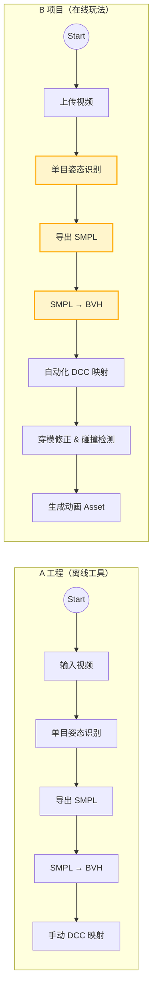

```mermaid
flowchart LR
    classDef migrated fill:#FFF5CC,stroke:#FFAA00,stroke-width:2px;

    subgraph A["A 工程（离线工具）"]
        Astart((Start))
        A1[输入视频]
        A2[单目姿态识别]
        A3[导出 SMPL]
        A4[SMPL → BVH]
        A5[手动 DCC 映射]
        Astart --> A1 --> A2 --> A3 --> A4 --> A5
    end

    subgraph B["B 项目（在线玩法）"]
        Bstart((Start))
        B1[上传视频]
        B2[单目姿态识别]
        class B2 migrated;
        B3[导出 SMPL]
        class B3 migrated;
        B4[SMPL → BVH]
        class B4 migrated;
        B5[自动化 DCC 映射]
        B6[穿模修正 & 碰撞检测]
        B7[生成动画 Asset]
        Bstart --> B1 --> B2 --> B3 --> B4 --> B5 --> B6 --> B7
    end
```