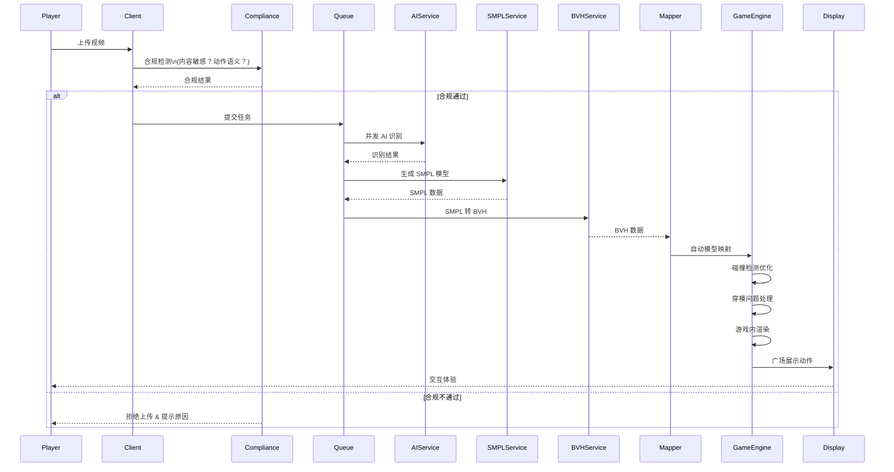

```mermaid
sequenceDiagram
    %% 参与者 %%
    participant 玩家          as Player
    participant 客户端        as Client
    participant 合规服务      as Compliance
    participant 任务队列      as Queue
    participant AI识别服务    as AIService
    participant SMPL生成服务  as SMPLService
    participant BVH转换服务   as BVHService
    participant 映射模块      as Mapper
    participant 游戏引擎      as GameEngine
    participant 展示/交互     as Display

    %% 上传与合规 %%
    玩家      ->> 客户端      : 上传视频
    客户端    ->> 合规服务    : 合规检测\n(内容敏感？动作语义？)
    合规服务  -->> 客户端      : 合规结果

    alt 合规通过
        %% 分发到云服务器逻辑层 %%
        客户端  ->> 任务队列    : 提交任务
        任务队列 ->> AI识别服务 : 并发 AI 识别
        AI识别服务 -->> 任务队列 : 识别结果
        
        任务队列 ->> SMPL生成服务 : 生成 SMPL 模型
        SMPL生成服务 -->> 任务队列 : SMPL 数据
        
        任务队列 ->> BVH转换服务  : SMPL 转 BVH
        BVH转换服务  -->> 映射模块 : BVH 数据

        %% 自动模型映射 %%
        映射模块  ->> 游戏引擎    : 自动模型映射
        
        %% 游戏引擎渲染管线 %%
        游戏引擎  ->> 游戏引擎    : 碰撞检测优化
        游戏引擎  ->> 游戏引擎    : 穿模问题处理
        游戏引擎  ->> 游戏引擎    : 游戏内渲染
        游戏引擎  ->> 展示/交互   : 广场展示动作
        展示/交互 -->> 玩家       : 交互体验
    else 合规不通过
        合规服务 -->> 玩家       : 拒绝上传 & 提示原因
    end

```