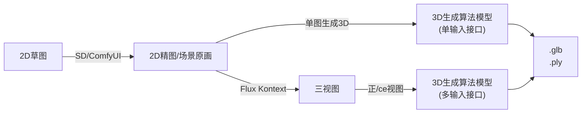

```mermaid
graph LR
    A[2D草图] -->|SD/ComfyUI| B[2D精图/场景原画]
    
    B -->|单图生成3D| D["3D生成算法模型<br/>(单输入接口)"]
    D --> F[".glb<br/>.ply"]
    
    B -->|Flux Kontext| C[三视图]
    
    C -->|正/ce视图| E["3D生成算法模型<br/>(多输入接口)"]

    E --> F
```