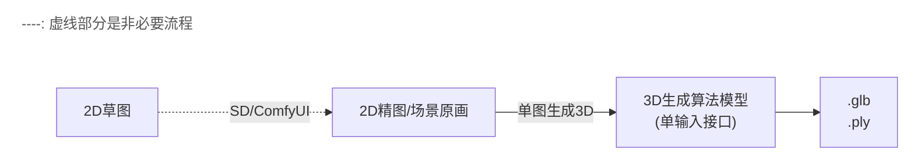

```mermaid
graph LR
    subgraph Legend ["----: 虚线部分是非必要流程"]
        direction LR
    end

    A[2D草图] -.->|SD/ComfyUI| B[2D精图/场景原画]
    
    B -->|单图生成3D| D["3D生成算法模型<br/>(单输入接口)"]
    D --> F[".glb<br/>.ply"]


    style Legend fill:#fff,stroke:#fff,stroke-width:0px,color:#555
```