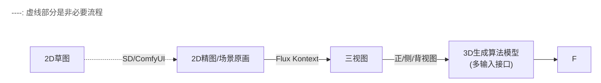

```mermaid
graph LR
    subgraph Legend ["----: 虚线部分是非必要流程"]
        direction LR
    end

    A[2D草图] -.->|SD/ComfyUI| B[2D精图/场景原画]
    

    
    B -->|Flux Kontext| C[三视图]
    
    C -->|正/侧/背视图| E["3D生成算法模型<br/>(多输入接口)"]

    E --> F

    style Legend fill:#fff,stroke:#fff,stroke-width:0px,color:#555
```