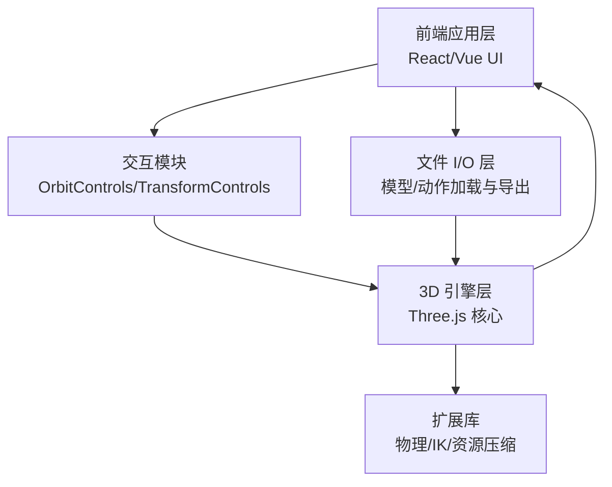

```mermaid
flowchart TD
    A[前端应用层<br/>React/Vue UI] --> B[交互模块<br/>OrbitControls/TransformControls]
    A --> C[文件 I/O 层<br/>模型/动作加载与导出]
    B --> D[3D 引擎层<br/>Three.js 核心]
    C --> D
    D --> A
    D --> E[扩展库<br/>物理/IK/资源压缩]


    
```